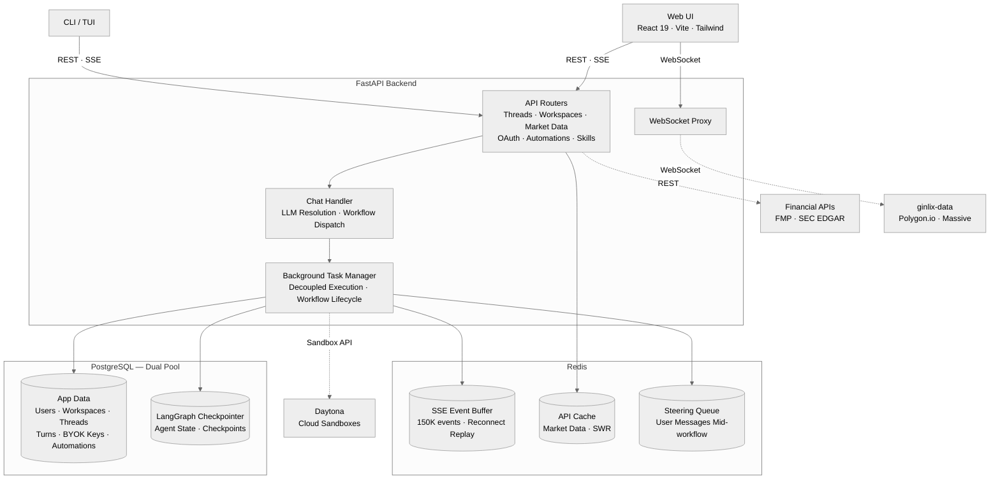
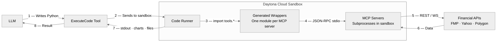
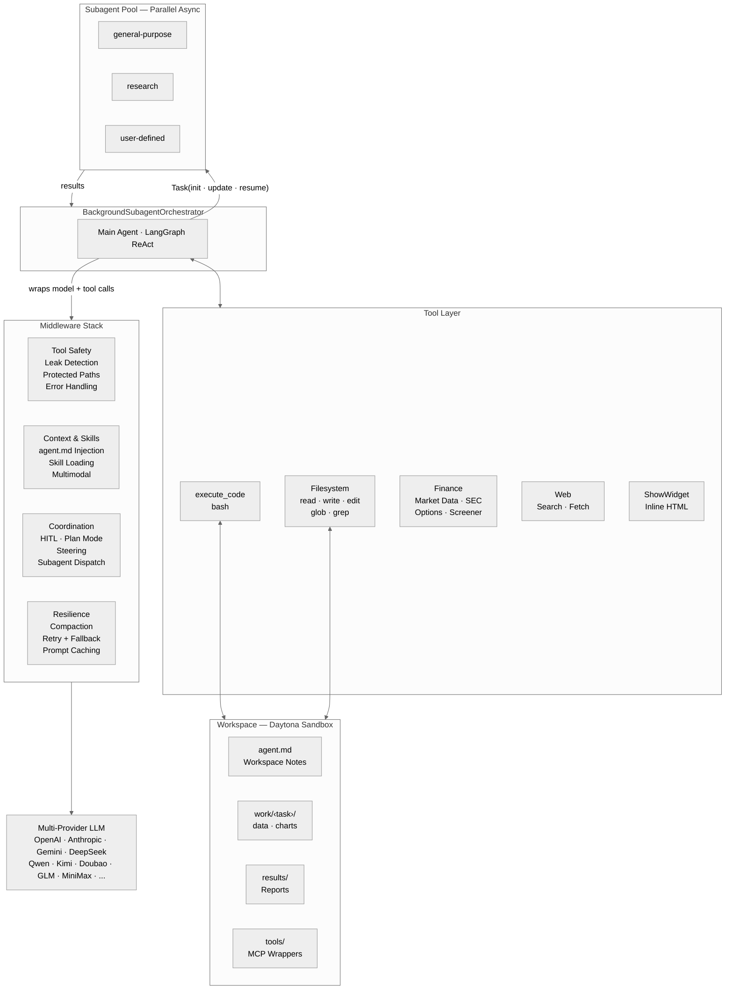

<p align="center">
  
  <br>
  <strong>vibe investing のための agent harness</strong>
  <br>
  LangAlpha は、金融市場の理解と投資判断を支援するために作られています。
  <br><br>
  
  <a href="https://github.com/langchain-ai/langchain"></a>
  
</p>

<p align="center">
  <a href="../README.md">English</a> ｜ <a href="README.zh-CN.md">简体中文</a> ｜ <strong>日本語</strong>
</p>

<p align="center">
  <a href="#クイックスタート">クイックスタート</a> &bull;
  <a href="api/README.md">API ドキュメント</a> &bull;
  <a href="../src/ptc_agent/">Agent Core</a> &bull;
  <a href="../src/server/">Backend</a> &bull;
  <a href="../web/">Web</a> &bull;
  <a href="../libs/ptc-cli/">TUI</a> &bull;
  <a href="../skills/">Skills</a> &bull;
  <a href="../mcp_servers/">MCP</a>
</p>

<p align="center">
  <video src="https://github.com/user-attachments/assets/56ec23b5-e9af-46ab-8505-66a7dff822a4" autoplay loop muted playsinline width="900"></video>
</p>
<p align="center"><em>ダッシュボードの厳選ニュースブリーフを agent に pin し、アイデア生成を開始して、並列 subagent にマーケットのスクリーニングを任せます。結果はインラインの対話型 dashboard に戻り、あなたのポートフォリオに合わせた 5 つのロング／ショート・ペアトレード案として提示されます。</em></p>

## LangAlpha を選ぶ理由

現在の AI 金融ツールの多くは、投資を一回限りのやり取りとして扱います。質問して、答えを受け取り、そこで終わりです。しかし実際の投資はベイズ的です。最初に仮説を持ち、新しいデータが日々入り、そのたびに確信度を更新していきます。仮説を磨き、ポジションを見直し、過去の分析の上に新しい分析を重ねるこのプロセスは、数週間から数か月にわたって続きます。単発の prompt だけでは、この流れを受け止めきれません。

### *vibe coding から vibe investing へ*

着想はソフトウェアエンジニアリングにあります。codebase は継続して存在し、各 commit はそれ以前の作業の上に積み上がります。Claude Code や OpenCode のようなコード agent harness が成果を上げたのは、agent が既存の文脈を探索し、過去の作業を土台に進められるようにしたからです。LangAlpha は同じ発想を投資に持ち込みます。agent に永続的な workspace を与えることで、リサーチは自然に積み上がります。

実際には、研究目的ごとに workspace を作成します。たとえば「Q2 リバランス」「データセンター需要の深掘り」「エネルギーセクターのローテーション」などです。agent はあなたの目的やスタイルをヒアリングし、最初の成果物を作成し、すべてを workspace のファイルシステムに保存します。翌日に戻ってきても、ファイル、thread、蓄積されたリサーチはそのまま残っています。

## 機能ハイライト

- **Progressive Tool Discovery** — MCP ツールは概要だけを context に載せ、完全なドキュメントは workspace に保存します。agent は本当に必要になった時点でツールを発見して使えます。JSON ツールを skill に紐づけ、skill が有効になったときだけ agent に公開することもできます。
- **Programmatic Tool Calling（PTC）** — agent は MCP server からの金融データを context window に流し込むのではなく、Python を書いて実行し、データを処理します。複雑な多段分析を可能にしつつ、token の浪費を大幅に減らします。
- **金融データエコシステム** — ネイティブツールは素早い参照に、MCP server は sandbox 内での大量データ処理、チャート作成、複数年分析に使う、多層的な data provider 構成です。
- **永続 workspace** — 各 workspace は専用 sandbox に対応し、構造化ディレクトリと workspace notes ファイル（`agent.md`）を持ちます。これにより session や thread をまたいでリサーチが蓄積されます。別系統の長期 memory store（`.agents/user/memory/`、`.agents/workspace/memory/`）は、継続的なユーザー設定や sandbox をまたぐ知識を保持します。ユーザー管理の memo store（`.agents/user/memo/`）には PDF や markdown のリサーチノートをアップロードでき、agent が必要に応じて参照します。
- **金融リサーチ Skills** — DCF モデル、初回カバレッジレポート、決算分析、モーニングノート、文書生成などの事前構築済み workflow を備えています。slash command でも自動検出でも起動できます。
- **Finance Research Workbench** — Web UI には、インライン金融チャート、複数形式のファイルビューア、TradingView チャート、リアルタイム WebSocket 市場データ、agent によるチャート注釈、turn ごとの source provenance パネル、共有可能な会話、subagent 監視が含まれます。
- **マルチ provider モデル層** — provider に依存しない LLM 抽象と、エラー時の自動 failover を備えます。
- **Automations** — 定期実行や一回限りのタスクをスケジュールできます。株式や指数がリアルタイム価格条件に到達したときに発火する価格トリガー型 automation も設定できます。
- **Secretary** — Flash agent は secretary としても動作します。workspace の作成と管理、バックグラウンドでの深い PTC 分析の dispatch、実行中タスクの監視、結果取得を、human-in-the-loop 承認付きの会話コマンドで行えます。
- **Agent swarm** — 分離された context window、事前ロードされた toolset/skills、実行中 steering、checkpoint ベースの resume、UI でのライブ進捗監視を備えた、並列非同期 subagent 群です。
- **Live steering** — agent や subagent の作業中に追加メッセージを送り、完了を待たずに方向修正、補足、リダイレクトができます。
- **Middleware stack** — skill loading、plan mode、マルチモーダル入力、auto-compaction、context management を扱う深く composable な middleware stack により、長時間の agent session を支えます。
- **Security & workspace vault** — pgcrypto による保存時暗号化、credential 漏えいの自動検出と redaction、sandboxed execution、agent が安全に利用できる workspace ごとの secret storage を提供します。
- **Channel integrations** — Slack、Discord、Feishu、Telegram から LangAlpha を使えます。スケジュール結果はメール配信もできます。
- **Production-ready infrastructure** — Redis buffer による再接続 replay 付きの SSE-streamed agent activity、HTTP 接続から切り離された background execution、PostgreSQL-backed state persistence を備えます。

## 技術基盤

**システムアーキテクチャ**



### マルチ Provider モデル層

LangAlpha は、複数の LLM backend を抽象化する provider-agnostic なモデル層で動作します。どのモデルが駆動していても、同じ middleware stack、tools、workflow が利用できます。標準で 2 つのモードを備えています。

- **PTC mode** は、深い多段階の投資リサーチ向けです。強い推論能力を使って分析方針を立て、金融データを整理し、複雑な分析のためのコードを書きます。長い context により、SEC filings とリサーチレポートを一度に突き合わせられます。
- **Flash mode** は、素早い会話応答と workspace orchestration 向けです。簡単な市場参照、MarketView での chart-and-chat、軽量 Q&A、workspace 管理やバックグラウンド PTC 分析の dispatch と結果通知を行う secretary として使えます。

**自分のモデルを持ち込む** — 既存の AI subscription や API key を直接使えます。OAuth で ChatGPT や Claude subscription（OpenAI Codex OAuth、Claude Code OAuth）を接続したり、Kimi（Moonshot）、GLM（Zhipu）、MiniMax、Doubao（Volcengine）の coding plan を使ったり、BYOK で任意の対応 provider の API key を設定できます。すべての key は PostgreSQL pgcrypto で保存時に暗号化されます（[Security](#security--workspace-vault) を参照）。

**モデル耐障害性** — 一時的なエラーでは自動 retry し、その後は設定済み fallback model に failover します。reasoning effort（`low`/`medium`/`high`）は provider 間で自動的に正規化されます。

### Programmatic Tool Calling（PTC）と Workspace アーキテクチャ

多くの AI agent は、一回限りの JSON tool call でデータを扱い、結果をそのまま context window に入れます。Programmatic Tool Calling は発想を反転させます。生データを LLM に渡す代わりに、agent が [Daytona](https://www.daytona.io/) cloud sandbox 内でコードを書いて実行し、ローカルにデータを処理し、最終結果だけを返します。これにより token の浪費を大きく抑え、通常なら context limit を超える分析も可能になります。

**PTC 実行フロー**



workspace 環境は、単一 session を超えた永続性も提供します。各 sandbox には構造化されたディレクトリがあります。`work/<task>/` はタスクごとの作業領域（data、charts、code）、`results/` は完成した report、`data/` は共有 dataset のための場所です。中間成果物は session をまたいで残ります。root には `agent.md` があり、agent が thread をまたいで維持する workspace notes として、workspace の目的、主要な発見、thread index、重要 artifact の file index を記録します。middleware layer は `agent.md` をすべての model call に注入するため、agent は毎回ファイルを読み直さなくても過去作業の文脈を把握できます。これとは別に、store-backed な long-term memory system（`.agents/user/memory/`、`.agents/workspace/memory/`）は、workspace reset 後も残るユーザー設定や sandbox 横断の知識を保持します。ユーザー管理の memo store（`.agents/user/memo/`）にはアップロードした文書を保存でき、PDF は server-side で text extraction され、metadata は LLM により非同期生成されるため、agent は topic に応じて検索・引用できます。各 workspace は、1 つの研究目的に紐づく複数の conversation thread をサポートします。

<p align="center">
  
</p>
<p align="center"><em>各 workspace は永続 sandbox に対応します。テーマ、portfolio、thesis ごとにリサーチを整理できます。</em></p>

<p align="center">
  
</p>
<p align="center"><em>agent はコードを書いて対話型 dashboard を構築します。ここでは Mag 7 と半導体の catalyst calendar を生成しています。</em></p>

### 金融データエコシステム

PTC は多段階のデータ処理、金融モデリング、チャート作成のような複雑な作業に向いています。一方で、すべてのデータ参照に code execution を起動するのは過剰です。そこで、よく使うデータを LLM が読みやすい形式に変換する native financial data toolset も用意しています。これらの tool は frontend に直接描画できる artifact も返すため、人間は agent の分析と並べて即座に視覚的な文脈を得られます。

**Native tools** は、direct tool call による素早い参照向けです。

- **Company overview**：リアルタイム quote、price performance、主要財務指標、analyst consensus、revenue breakdown
- **SEC filings**（10-K、10-Q、8-K）：earnings call transcripts と引用しやすい markdown 形式
- **Market indices** と **sector performance**：市場全体の文脈
- **Web search**（Tavily、Serper、Bocha）：manifest-driven provider selection、深さの段階選択（fast lookup から deep research）、image search、AI research mode、ユーザーごとの選択に対応。さらに circuit breaker fault tolerance を備えた **web crawling**

**MCP servers** は、PTC code execution で扱う raw data 向けです。

- **Price data**：株式、commodity、crypto、forex の OHLCV time series、short interest、short volume analytics
- **Fundamentals**：複数年 financial statements、ratios、growth metrics、valuation、insider trades、dividends and splits、share float、key executives、technical indicators
- **Macro economics**：GDP、CPI、unemployment、Fed funds rate、treasury yield curve（1M–30Y）、country risk premiums、economic calendar、earnings calendar
- **Options**：filtering 可能な options chain、option contracts の historical OHLCV、real-time bid/ask snapshots
- **Yahoo Finance suite**（price、fundamentals、analysis、market）：key 不要で statements、analyst ratings、holders、screening、calendars をカバー
- **X（Twitter）**：sentiment と event tracking のための read-only post search、user/tweet lookup、thread fetch。JS-rendered や anti-bot-protected pages 向けの **scraping** server もあります。

agent は適切な layer を自動で選びます。context に収まる素早い lookup には native tools を使い、bulk data processing、charting、sandbox 内での複数年 trend analysis が必要な場合は MCP tools を使います。

MCP server は workspace ごとに設定できます。built-in server は個別に無効化できます。custom HTTP または stdio server（[workspace vault](#workspace-vault) から credential を読むものを含む）は API や UI から追加でき、restart なしで数秒以内に反映されます。

#### Data Provider Fallback Chain

LangAlpha は 3 層の data provider hierarchy をサポートします。各層は任意で、上位層が利用できない場合でも、システムは自動的に下位層へフォールバックします。

| Tier | Provider                          | 必要な Key        | 追加される内容                                                                               |
| ---- | --------------------------------- | ----------------- | ------------------------------------------------------------------------------------------ |
| 1    | **ginlix-data**（hosted proxy）   | `GINLIX_DATA_URL` | リアルタイム WebSocket price feed、intraday data、extended trading hour data、options data |
| 2    | **FMP**（Financial Modeling Prep）| `FMP_API_KEY`     | 高品質 fundamentals、financial statements、macro data、analyst data                        |
| 3    | **Yahoo Finance**（yfinance）     | *不要、無料*      | Price history、basic fundamentals、earnings、holdings、insider transactions、ESG、screener |

すべての tier はデフォルトで有効です。**無料データのみ**（Yahoo Finance）で動かしたい場合は、`make config` を実行して prompt で選択してください。`agent_config.yaml` を手動編集することもできます。

> [!NOTE]
> Yahoo Finance のデータは community-sourced であり制限があります。1 時間未満の intraday data はなく、quotes は delayed、macro coverage は限定的で、rate limiting が起きることもあります。`FMP_API_KEY` の設定を強く推奨します（[free tier available](https://site.financialmodelingprep.com/)）。

### 金融リサーチ Skills

agent には 23 個の事前構築済み金融リサーチ skill が含まれており、それぞれ slash command または automatic detection で有効化できます。Skills は [Agent Skills Spec](https://agentskills.io/specification) に従っており、workspace に `SKILL.md` ファイルを置くことで拡張できます。

| Category                 | Skills                                                                                      |
| ------------------------ | ------------------------------------------------------------------------------------------- |
| **Valuation & Modeling** | DCF Model、Comps Analysis、3-Statement Model、Model Update、Model Audit                     |
| **Equity Research**      | Initiating Coverage（30–50 ページ report）、Earnings Preview、Earnings Analysis、Thesis Tracker |
| **Market Intelligence**  | Morning Note、Catalyst Calendar、Sector Overview、Competitive Analysis、Idea Generation、X Research |
| **Document Generation**  | PDF、DOCX、PPTX、XLSX、HTML：create、edit、extract                                          |
| **Operations**           | Investment Deck QC、Scheduled Automations、User Profile & Portfolio                         |

謝辞：一部の skill は [anthropics/financial-services-plugins](https://github.com/anthropics/financial-services-plugins) を元にしています。

<p align="center">
  
</p>
<p align="center"><em>Comps Analysis skill は Excel model と PDF report を出力します。同業他社 multiple から導いた implied price range も含まれます。</em></p>

### マルチモーダル Intelligence

agent は画像（PNG、JPG、GIF、WebP）と PDF をネイティブに読み取れます。multimodal middleware が file read を捕捉し、sandbox や URL から content を download し、base64 として conversation に注入することで、視覚情報を直接解釈できます。MarketView では、ユーザーの live candlestick chart を capture して multimodal context として agent に送信できます。capture には chart image だけでなく、symbol、interval、OHLCV、moving averages、RSI、52-week range などの structured metadata も含まれるため、agent は視覚パターンと基礎データの両方から推論できます。

<p align="center">
  
</p>
<p align="center"><em>MarketView は live chart を agent に送り、リアルタイムの technical analysis を行います。</em></p>

### Agent によるチャート注釈

agent に MarketView chart への注釈を依頼すると、canvas に直接描画します。price levels、trendlines、Fibonacci retracements、event badges、rectangles、text markers に対応します。Annotations は SSE 経由で live stream され、workspace および `symbol:timeframe` ペアごとに永続化されます（`NVDA:1day` の描画は `NVDA:1hour` とは別管理です）。再接続時には replay されます。MarketView 外で会話している場合、chat transcript には annotation legend と live chart への one-click link を持つ mini-preview card が表示されます。MarketView から message が送信されると chart-annotation skill が自動ロードされるため、agent は常に「この chart」がどの ticker と timeframe を指すか理解しています。

### Automations

agent は会話の中から自分の task を schedule できます。別 UI は不要です。専用 Automations page では、full CRUD、execution history、manual trigger で automations を管理できます。すべての automation type は同じ `AutomationExecutor`、設定可能な agent mode（PTC または Flash）、連続失敗後の自動無効化を共有します。

**Time-based** — recurring schedules（「毎週月曜 9 時にこの分析を実行」）には標準 cron expression を、一回限りの future execution には one-shot datetime scheduling を使います。

**Price-triggered** — 任意の株式や主要指数に price target または percentage move を設定し、条件が満たされた瞬間に agent が指示を実行します。`PriceMonitorService` は [ginlix-data](https://github.com/ginlix-ai/ginlix-data) への shared upstream WebSocket connection から real-time ticks を購読します（stocks は realtime tier、indices は delayed tier）。Redis-based deduplication により、server instances 間の duplicate trigger を防ぎます。

| Condition                    | Example                                        |
| ---------------------------- | ---------------------------------------------- |
| Price above / below          | AAPL が $200 を超えたら trigger                |
| Percent change above / below | SPX が前日終値から +2% 動いたら trigger        |

条件は AND logic で組み合わせられます。各 price automation は **one-shot**（一度だけ発火）または **recurring** mode をサポートし、cooldown を設定できます（最短 4 時間、デフォルトでは trading day ごとに 1 回）。

> [!NOTE]
> Price-triggered automations には ginlix-data からの real-time WebSocket feed が必要です。beta 期間中、この機能は [hosted platform](https://ginlix.ai) のみで利用できます。より広範な WebSocket data source 対応は将来の release で予定されています。

<p align="center">
  
</p>
<p align="center"><em>定期リサーチを schedule できます。ここでは Mag 7 の pre-earnings analysis が各決算前に自動実行されます。</em></p>

**Agent アーキテクチャ**



### Agent Swarm

core agent は [LangGraph](https://github.com/langchain-ai/langgraph) 上で動作し、`Task()` tool により parallel async subagents を起動します。subagent は分離された context window で同時実行されるため、長い reasoning chain の drift を防ぎます。各 subagent は synthesized result を main agent に返し、orchestrator を軽量に保ちます。main agent は subagent の結果を待つことも、他の pending work を続けることもできます。UI の **Subagents** view に切り替えると、進捗をリアルタイムで確認できます（web frontend のみ）。

単純な dispatch に加え、main agent は実行中の subagent に follow-up instruction を送れます。完了済み subagent を full context 付きで resume し、反復的に refined することもできます。server が restart した場合、subagent state は最後の checkpoint から自動的に再構築されます。

<p align="center">
  
</p>
<p align="center"><em>research subagents は compute chain 全体を並列に調査します。結果は NVIDIA、Google、AMD、AWS など業界全体をまたぐ対話型 AI compute timeline に統合されます。</em></p>

### Middleware Stack

agent には以下を含む middleware stack が同梱されています。

- **Live steering** — agent が分析中に誤った方向へ進んだり、関係の薄いデータを追ったり、意図を誤解したりすることがあります。steering により、完了を待たずに軌道修正できます。agent の作業中いつでも follow-up message を送り、更新した指示、補足、まったく新しい質問を伝えると、agent は次の step の前にそれを受け取ります。steering はすべての layer で機能します。main agent を redirect し、個別の background subagent に follow-up を送り、workflow が先に終わった場合は未消費 message を input box に戻します。作業は失われず、restart も不要です。
- **Dynamic skill loading** — `LoadSkill` tool により、agent は必要に応じて skill toolsets を発見・有効化できます。default tool surface を小さく保ちながら、必要なときだけ専門機能を利用できます。
- **Multimodal** — images と PDFs の file read を捕捉し、sandbox や URL から content を download して base64 として conversation に注入します。multimodal models がネイティブに解釈できます。
- **Plan mode** — human-in-the-loop interrupt により、実行前に agent の strategy を review and approve できます。
- **Auto-compaction** — token limit に近づくと conversation history を圧縮し、重要 context を保持しながら空き容量を作ります。
- **Context management** — 大きな tool result を workspace filesystem に自動退避し、context には短い preview だけを残します。conversation が長くなると古い turn を要約しつつ compaction し、full transcript は workspace から復元できます。research session は context limit に突き当たらず長期間動かせます。

完全な一覧は [`src/ptc_agent/agent/middleware/`](../src/ptc_agent/agent/middleware/) を参照してください。

謝辞：一部の middleware components は [LangChain DeepAgents](https://github.com/langchain-ai/deepagents) の実装を元に、またはそこから着想を得ています。

### Streaming と Infrastructure

server は agent activity のすべてを SSE で stream します。text chunks、arguments と results 付き tool calls、subagent status updates、file operation artifacts、human-in-the-loop interrupts が含まれます。agent の各 decision は UI 上で完全に trace できます。

workflow は HTTP/SSE connection から完全に分離された independent background task として動作します。browser tab を閉じたり network が切れたりしても、agent は作業を続けます。再接続時には最大 150,000 件の buffered events が replay され、client は中断地点から正確に復帰します。

PostgreSQL は LangGraph checkpointing、conversation history、user data（watchlists、portfolios、preferences）を支え、agent state と user context を session 間で永続化します。Redis は SSE events を buffer し、browser refresh や network drop でも in-flight messages を失わないようにします。client は自動的に reconnect and replay します。user data は database-backed virtual JSON files として agent に公開され、read は live rows をオンデマンドに serialize し、write は sandbox sync round-trip なしで単一の validated transaction として適用されます。skills は session init 時に manifest-based cache を通じて sandbox に同期され、変更時だけ再アップロードされます。詳細は完全な [API reference](api/README.md) を参照してください。

### Source Provenance

agent が触れた外部 data source はすべて trace され、表示されます。provenance middleware は、web search、page fetch、SEC filing、market-data call、MCP tool invocation、workspace file read を記録します。background subagents による access も含まれます。各 source につき `provenance` stream event が発行されますが、これらは LLM context には入りません。UI は各 turn の横に Sources panel として表示します。source は type ごとに group 化され、web origin には favicon が付き、detail view では provider、timestamp、captured arguments、content fingerprint、snippet を確認できます。*This turn / All sources* toggle により thread 全体の data footprint を表示できます。file や memo source をクリックすると workspace file panel で直接開けます。すべての research output の背後に、監査可能な data trail が残ります。

## Security & Workspace Vault

LangAlpha は credential、code execution、user-supplied secrets に対し、layered security model を適用します。

**Encryption at rest** — すべての sensitive data（BYOK API keys、OAuth tokens、vault secrets）は PostgreSQL 内で `pgcrypto` により暗号化されます。plaintext は database に保存されません。

**Credential leak detection** — すべての tool output は LLM context に届く前に scan されます。middleware は既知の secret values（MCP server keys、sandbox tokens、vault secrets）を解決し、一致するものを `[REDACTED:KEY_NAME]` として redact します。同じ redaction は human-facing surfaces にも適用され、file reads と downloads は client に届く前に scrub されます。

**Sandboxed code execution** — 各 workspace は、専用 filesystem と network boundary を持つ [Daytona](https://www.daytona.io/) cloud sandbox で動作します。protected path guards は agent が internal system directories に access するのを防ぎます。tool input は実行前に short-circuit され、tool output は leaked paths を redact します。

### Workspace Vault

各 workspace には、code execution 中に agent が使う API keys や credentials を保存する secret vault が組み込まれています。third-party data sources（brokerage APIs、external data vendors など）への access や、workspace 内での LLM-powered workflow 構築に役立ちます。UI で一度 secret を保存すると、その workspace のすべての agent session から簡単な Python API で利用できます。

```python
from vault import get, list_names, load_env

api_key = get("MY_API_KEY")       # retrieve a single secret
names = list_names()               # list available secret names
load_env()                         # bulk-load all secrets as env vars
```

vault secrets は上記すべての保護層を継承します。保存時暗号化、agent および human-facing output からの redaction、direct file access の block が適用されます。secret の作成、更新、表示、削除ができるのは workspace owner のみです。

## Frontend

Web UI は単なる chat interface ではなく、完全な research workbench です。

- **Configurable dashboard** — preset layout（Morning Brief、Trader、Researcher、Agent Desk、Trader (TradingView)、Portfolio Steward）から始めるか、markets、intelligence、personal context、agent surfaces、workspace shortcuts を含む widget gallery から自分で構成できます。
- **Inline financial charts** — tool results は chat thread 内で interactive sparklines、bar charts、overview cards として描画されます。
- **Inline HTML widgets** — agent は `ShowWidget` tool を通じて interactive HTML/SVG visualizations（Chart.js charts、metric cards、data tables）を chat 内に直接描画できます。theme-aware styling と sandboxed iframe に対応します。
- **HTML research reports** — agent は self-contained HTML documents を `results/` に書き出します。実ブラウザの semantics で提供され、scripts は実行され、CDN libraries は load され、relative assets は解決されます。fullscreen 表示と PDF export が可能で、inline widgets や live dashboards とは別物です。
- **Multi-format file viewer** — PDF（paginated、zoomable）、Excel、CSV、HTML preview、source code（diff mode 付き Monaco editor）を download なしで inline 表示できます。
- **TradingView charting** — drawing tools、indicators、professional candlestick styling を備えた完全な TradingView Advanced Chart です。
- **Live market data** — 1 秒 tick resolution（US equities）の real-time WebSocket price feed、extended hours visualization、複数 moving average overlays に対応します。
- **Agent-drawn chart annotations** — agent は MarketView chart に price levels、trendlines、Fibonacci retracements、event badges を描画し、`symbol:timeframe` ごとに永続化します。chat 内でも preview されます。
- **Shareable conversations** — one-click sharing と granular permissions（file browsing と download access の切替）により、public URL で replay できます。
- **Real-time subagent monitoring** — 各 background task の streaming output と tool calls を live に確認でき、mid-execution instructions も送れます。
- **Source provenance panel** — 各 turn に、agent が access した external sources（web、SEC filings、market data、MCP tools、files）を favicons、content fingerprints、per-thread scope toggle とともに表示します。
- **Automations** — cron builder、execution history、manual trigger、stock や index が real-time price condition に達したときに発火する price-triggered automations を備えた CRUD management です。

<p align="center">
  
</p>
<p align="center"><em>dashboard は market indices、personalized brief、watchlist を表示します。どの tile も agent に chat context として pin でき、research thread を開始できます。</em></p>

<table align="center">
  <tr>
    <td width="50%">
      
    </td>
    <td width="50%">
      
    </td>
  </tr>
  <tr>
    <td align="center"><em>Morning Brief、Agent Desk、Researcher、Trader などの curated preset から始められます。</em></td>
    <td align="center"><em>または widget gallery から markets、intelligence、personal、agent、workspace を自由に組み合わせられます。</em></td>
  </tr>
</table>

## Channel Integrations

普段使っている tool から LangAlpha を利用できます。integration gateway は messaging platform と core agent の間で message を relay し、各チャネルでは、それぞれの形式に合わせたレスポンスを受け取れます。channel integrations は hosted service 限定で、one-click setup と quick account binding に対応しています。開始するには [integrations](https://ginlix.ai/account/integrations) を開いてください。

| Feature                        | Slack | Discord | Feishu | Telegram | WhatsApp |
| ------------------------------ | ----- | ------- | ------ | -------- | -------- |
| Rich text / markdown           | ✅     | ✅       | ✅      | ✅        | 🔜       |
| File upload（user → agent）    | ✅     | ✅       | ✅      | ❌        | ➖        |
| File download（agent → user）  | ✅     | ✅       | ✅      | ❌        | ➖        |
| Image rendering                | ✅     | ✅       | ✅      | ❌        | ➖        |
| Human-in-the-loop interrupts   | ✅     | ✅       | ✅      | ⚠️       | ➖        |
| Subagent tracking              | ✅     | ✅       | ✅      | ✅        | 🔜       |
| Workspace / model selection    | ✅     | ✅       | ✅      | ✅        | 🔜       |
| Automation delivery（outbound）| ✅     | ✅       | ❌      | ➖        | ➖        |
| Simplified account linking     | ✅     | ✅       | ❌      | ❌        | ➖        |
| Slash commands                 | ✅     | ✅       | ✅      | ✅        | ➖        |

Slack と Discord は native channels と thread-level groups を提供しており、LangAlpha の workspaces と threads に自然に対応します。context は native mechanism で管理されます。Telegram と WhatsApp にはこうした仕組みがないため、簡略化したオーケストレーションで動作します。Feishu は完全な messaging と card-based UI を備え、OAuth は近日対応予定です。Telegram は一部対応済みで、今後さらに対応範囲を広げる予定です。WhatsApp は計画中です。

## クイックスタート

> [!TIP]
> **self-host したくない場合**は、[hosted version](https://ginlix.ai) を試してください。FMP、real-time market data、cloud sandboxes を含む full data infrastructure が最初から使えます。自分の LLM key（BYOK）を持ち込めば、すぐに始められます。

LangAlpha は **Docker だけ**で起動できます。data API key も cloud sandbox も不要です。インフラは Docker だけで動かし、AI モデルには手元の LLM サブスクリプションを利用できます。

```bash
git clone https://github.com/ginlix-ai/langalpha.git
cd langalpha
make config   # interactive wizard — .env を作成し、LLM、data sources、sandbox、search を設定
make up       # PostgreSQL、Redis、backend、frontend を起動
```

- **Frontend:** [http://localhost:5173](http://localhost:5173)
- **Backend API:** [http://localhost:8000](http://localhost:8000)（interactive docs は `/docs`）
- **Verify:** `curl http://localhost:8000/health`

完全な体験には、wizard が optional keys の入力を促します。あとから `.env` に追加することもできます。

| Key                                  | 何が使えるようになるか                                                                                                  |
| ------------------------------------ | ----------------------------------------------------------------------------------------------------------------------- |
| `DAYTONA_API_KEY`                    | session をまたいで workspace を維持できる persistent cloud sandboxes（[daytona.io](https://www.daytona.io/)）          |
| `FMP_API_KEY`                        | 高品質な fundamentals、macro、SEC filings、options（[free tier available](https://site.financialmodelingprep.com/)）   |
| `SERPER_API_KEY` または `TAVILY_API_KEY` | Web search                                                                                                          |
| `LANGSMITH_API_KEY`                  | LangGraph runs の LangSmith tracing                                                                                    |
| `OTEL_EXPORTER_OTLP_ENDPOINT`        | OpenTelemetry traces と metrics を任意の OTLP backend（Jaeger、Grafana Tempo、Datadog、Honeycomb など）へ送信          |
| `SANDBOX_PROVIDER`                   | sandbox provider（`daytona` または `docker`）を上書き。未設定時は `DAYTONA_API_KEY` から自動判定                       |

> [!NOTE]
> 外部 service key がなくても機能しますが、体験は一部制限されます。Yahoo Finance は無料で price history、fundamentals、earnings、analyst data を提供しますが、real-time quotes、intraday tick data、macro economics、options analytics はありません。Docker sandbox は Daytona cloud sandboxes の代替として動き、PTC code execution は利用できますが、security と isolation は低下します。必要に応じて key を追加すると、より多くの機能が解放されます。

利用可能な command は `make help` で確認できます。Docker を使わない手動 setup は [CONTRIBUTING.md](../CONTRIBUTING.md#manual-setup) を参照してください。

## ドキュメント

- **[API Reference](api/README.md)**：chat streaming、workspaces、workflow state などの endpoints
- **Interactive API docs**：server 稼働中に `http://localhost:8000/docs` で利用できます

## Contact

partnership、collaboration、一般的な問い合わせは [contact@ginlix.ai](mailto:contact@ginlix.ai) までご連絡ください。

## Disclaimer

LangAlpha はリサーチツールであり、金融アドバイザーではありません。本ソフトウェアが生成する内容は、投資助言、推奨、またはいかなる証券の売買勧誘にも該当しません。すべての出力は情報提供および教育目的のみです。ご自身の判断で利用し、投資判断の前には必ずご自身でデューデリジェンスを行ってください。

## License

Apache License 2.0
