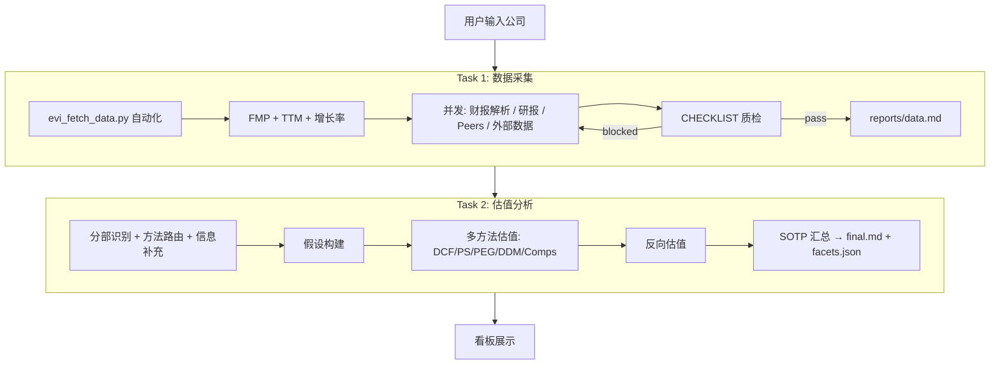
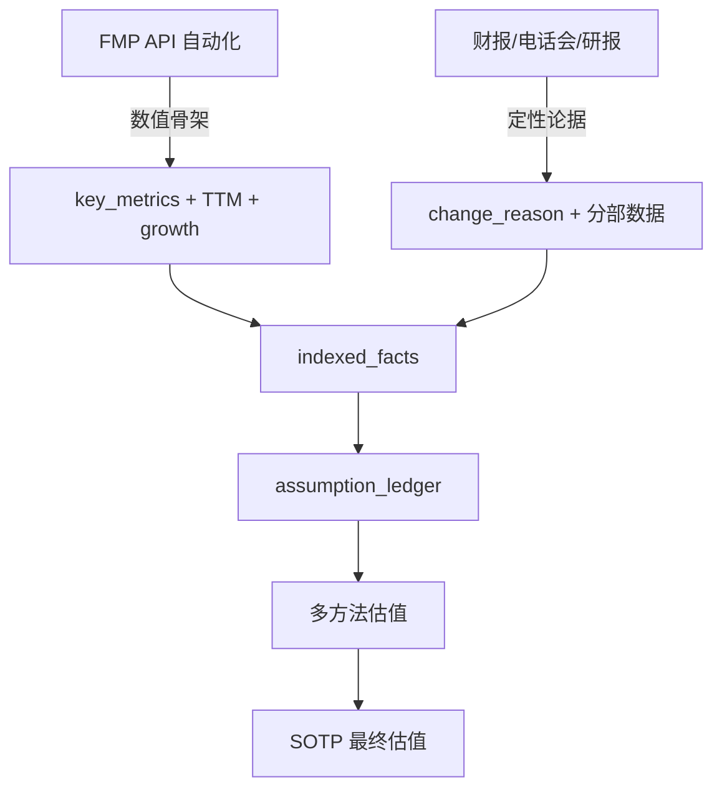

# EVI 估值策略 — AI 估值分析逻辑

---

## 1. 设计目标

以估值为导向的 AI 投研分析。核心逻辑：

1. **了解公司**：业务结构、商业模式、各业务线的驱动因子
2. **制定估值体系**：按业务分部选择适合的估值方法（DCF/PS/PEG/DDM/Comps），大公司拆分各业务线分别估值（SOTP）
3. **严谨分析**：所有估值假设必须有事实论据支撑，引入核查辩论机制——模型必须自主思考而非一味引用
4. **持续跟踪**：估值不是一次性的，建立好分析体系后可定时监控新材料、自动触发重估

---

## 2. 两大核心原则

### 2.1 FMP 为骨架，财报为论据

```
FMP 结构化数据（自动化获取+计算）
  → 告诉你"是什么"：毛利率 40%，YoY +5pp，PE_TTM 25x
  
财报 / 电话会 / 研报（Agent 解析）
  → 告诉你"为什么"：产品结构优化 + 高毛利软件占比提升
  → 告诉你"将来会怎样"：管理层指引、分析师假设
```

### 2.2 报告优先，结构化数据从报告提取

- 每个阶段的**主交付物**是 markdown 报告（人类可读、有引用、有表格）
- 结构化 JSON 是报告的附产品，给看板和后续计算消费
- 报告必须展示**完整的分析过程和逻辑推导**，不能只有结论

---

## 3. 整体流程

### 3.1 两阶段拆分

| 阶段 | 内容 | 结束条件 |
|---|---|---|
| **Task 1：数据采集** | FMP 自动化 + 并发补充数据 + CHECKLIST 质检 | CHECKLIST.overall ≠ blocked |
| **Task 2：估值分析** | 分部识别 → 方法路由 → 假设构建 → 多方法估值 → SOTP 汇总 | facets.json + final.md |

### 3.2 首次分析流程

```
用户输入（公司名 + 代码 + 市场）
      │
      ▼
═══ Task 1：数据采集 ═══════════════════════════════
│
│  Step 1: 自动化（脚本完成，无需 Agent 干预）
│    ├─ FMP 6张财报表（年报+季报）
│    ├─ TTM 自动计算（PE_TTM / PS_TTM / EV_EBITDA_TTM）
│    ├─ 增长率矩阵自动计算（YoY% / QoQ%）
│    ├─ 8项核心指标自动计算
│    └─ 电话会下载（港美股 FMP 直取）
│
│  Step 2: 并发 4 子任务
│    ├─ [A] 财报解析 → 为 FMP 指标补"为什么"的论据 + 分部数据
│    ├─ [B] 研报搜索（保留分析师完整分析过程）
│    ├─ [C] 可比公司 Peers 数据
│    └─ [D] 外部行业/产品数据 + A股电话会
│
│  Step 3: 汇总 + CHECKLIST 质检门禁
│  Step 4: 输出 reports/data.md → persist(partial)
│
      ▼
═══ Task 2：估值分析 ═══════════════════════════════
│
│  Phase 2: 并发
│    ├─ [G] 业务分部识别 → segments.md
│    ├─ [H] 估值方法路由 → valuation_router.md
│    └─ [I] 补充信息搜集 → facts.md
│
│  Phase 3: 有序 + 内部并发
│    ├─ [J] 假设构建（增长桥/利润桥/风险调整）→ assumptions.md
│    ├─ [K] 多方法估值（按 segment × method 并发）→ valuation.md
│    ├─ [L] 反向估值 → reverse_valuation.md
│    └─ [M] SOTP 汇总 → final.md + facets.json
│
│  Phase 4: persist(completed)
│
      ▼
═══ 持续跟踪（定时触发）══════════════════════════
│
│  monitor → 发现新材料
│  → 更新 indexed_facts
│  → 判断影响哪些假设
│  → 重跑受影响的估值方法
│  → 更新最终估值
│  → 记录变更到 memory.md
│
      ▼
  看板自动更新
```

---

## 4. Task 1：数据采集逻辑

### 4.1 自动化层（脚本计算，不需要 AI 干预）

`evi_fetch_data.py --quarterly --ttm --growth-rates` 一键完成：

| 输出 | 内容 |
|---|---|
| `base/fmp/*.json` | FMP 6张原始表（年报） |
| `base/fmp/quarterly/*.json` | 最近12个季度数据 |
| `indicators/key_metrics.json` | 8项核心指标 × 全部期数 |
| `indicators/ttm_metrics.json` | TTM: Revenue/NI/EBITDA/FCF/PE/PS/EV_EBITDA + margins |
| `indicators/growth_rates.json` | 增长率矩阵: Revenue/NI/Margins 的 YoY% + QoQ% |
| `base/transcripts/raw/*.md` | 电话会纪要（港美股 FMP 直取） |

**自动计算的指标**：

| 类别 | 指标 |
|---|---|
| 核心指标 | ROE / ROIC / gross_margin / operating_margin / rd_ratio / fcf / debt_to_ebitda / interest_coverage |
| TTM 倍数 | PE_TTM / PS_TTM / EV_EBITDA_TTM / PB |
| TTM 利润率 | gross_margin_ttm / operating_margin_ttm / net_margin_ttm |
| 增长率 | revenue_yoy% / revenue_qoq% / net_income_yoy% / net_income_qoq% / margin变动(pp) |

### 4.2 AI 补充层（并发子任务）

| 子任务 | 目的 | 关键要求 |
|---|---|---|
| 财报解析 | 为 FMP 数值补充"为什么"的论据 + 提取分部数据 | 以 FMP 指标为 key，找变化原因 |
| 研报搜索 | 获取市场观点和分析师逻辑 | **保留完整分析过程**，不能只摘结论 |
| Peers 数据 | 可比公司倍数 | 每个 peer 也用 FMP 自动获取 TTM |
| 外部数据 | 行业规模/出货量/政策/竞争格局 | A股电话会也在此补充 |

### 4.3 财务指标结构（FMP 为骨架 + 财报为论据）

```json
{
  "metric": "gross_margin",
  "period": "2025",
  "value": 40.2,
  "unit": "%",
  "yoy_change_pp": 5.1,
  "qoq_change_pp": 1.2,
  "source": "FMP",
  "change_reason": "产品结构优化+高毛利软件占比提升 [^ref1]",
  "change_reason_source": "2025年报 MD&A / 电话会管理层解释",
  "fmp_cross_check": {"status": "matched"}
}
```

### 4.4 数据来源覆盖

| 功能 | 港股 | 美股 | A股 |
|---|---|---|---|
| 财务数据 | FMP ✓ | FMP ✓ | FMP ✓ |
| 季度数据 | FMP quarterly ✓ | FMP quarterly ✓ | FMP quarterly ✓ |
| 财报 PDF | HKEx 披露易 | SEC 10-K | 巨潮资讯 |
| 电话会 | FMP ✓ | FMP ✓ | WebSearch（FMP 无） |
| 研报 | FMP + WebSearch | FMP + WebSearch | 东方财富 + WebSearch |

> 财报/公告下载复用 `sirius-valuation/scripts/download_knowledge.py`

---

## 5. Task 2：估值分析逻辑

### 5.1 业务分部识别

读取财报中的分部数据 + MD&A + FMP 指标，识别：
- 每个业务线的名称、收入占比、利润占比
- 各业务的增长特征（高增长/稳定/衰退）
- 数据披露口径和缺口

### 5.2 估值方法路由

根据业务特征选择估值方法：

| 业务特征 | 推荐方法 | 逻辑 |
|---|---|---|
| 盈利稳定、现金流可预测 | DCF (primary) + PE Band (cross) | 可折现 |
| 高增长、尚未盈利 | PS (primary) + DCF Scenarios (cross) | 收入是唯一锚 |
| 有分红历史 | DDM (primary) + DCF (cross) | 分红可折现 |
| 有明确 peer set | Comps (cross check) | 市场定价参考 |
| 所有业务 | Reverse Valuation | 检验市场隐含预期 |

### 5.3 假设构建（核心环节）

**以 indexed facts 为基础，自主分析推导假设**：

```
事实（来自数据库）
  → "云业务 2025 收入增长 15%，主要来自企业服务需求恢复" [1]
  → "管理层指引 2026 云收入增速 10-15%" [2]
  → "同行 AWS/Azure 增速 20-25%" [3]

推导（AI 自主分析）
  → 行业增速 vs 公司增速差异原因
  → 管理层指引的可信度评估
  → 结构性变化（如 AI 需求）的影响

假设（三场景）
  → Bear: 8%（管理层指引下限，考虑宏观压力）
  → Base: 12%（管理层中位 + 行业需求支撑）
  → Bull: 18%（AI 需求超预期 + 份额提升）
```

**硬规则**：
- 管理层话术不能直接映射增长率（需交叉验证）
- 增长率必须来自收入桥（量 × 价，或客户数 × ARPU）
- 所有假设必须引用 indexed facts
- 低可靠性事实不能单独支撑核心假设
- 每个假设带 confidence 分数

### 5.4 多方法估值（按 segment × method 并发）

每个估值方法独立运行，消费 assumption_ledger：

| 方法 | 核心逻辑 | 关键输出 |
|---|---|---|
| **DCF** | 5年预测 FCF → 终值 → 折现回今天 | Bear/Base/Bull EV + 敏感性矩阵 |
| **PS** | Forward Revenue × 合理 PS 倍数 | Bear/Base/Bull EV |
| **PEG** | Normalized EPS × (Growth Rate × PEG) | 合理 PE 区间 |
| **DDM** | 两阶段股息折现 | 内在价值下限 |
| **Comps** | Peer 中位倍数 × 目标公司指标 | 市场定价参考 |
| **Reverse** | 当前价格反推 → 隐含增长率/利润率 | 市场已 price-in 多少 |

### 5.5 SOTP 汇总

```
各分部 EV 加总
+ 投资资产（上市折价 25% / 非上市折价 55%）
+ 净现金
- 控股公司折价
÷ 总股数
= 每股公允价值（Bear / Base / Bull）
```

**方法权重规则**：
- Primary method: 50% 权重
- Cross-check methods: 平分剩余 50%
- 偏离 Primary > 30% 的方法权重砍半
- Confidence < 0.4 的方法权重砍半

---

## 6. 持续跟踪逻辑

### 6.1 监控触发

通过 LangAlpha Automations 框架注册定时任务（如每周一次）：

```
monitor 扫描
  → 新财报？新电话会？新研报？新公告？
  → 产品数据变化？行业新闻？
  → 价格大幅波动？
```

### 6.2 重估流程

```
发现新材料
  → 更新 indexed_facts（新增 / 修正旧 fact）
  → 生成 information_delta（哪些 fact 变了）
  → 判断影响哪些 assumptions
  → 重跑受影响的估值方法（只重算变化的部分）
  → 更新 SOTP + facets.json
  → 记录到 memory.md（变更日志）
  → 看板自动刷新
```

### 6.3 变更追踪

每次重估都记录：
- 触发原因（什么新材料）
- 影响范围（哪个 segment / 哪个假设）
- 估值变化（base 从 X 变为 Y）
- 判断变化（如 "低估" → "合理"）

---

## 7. Skill 集合

| Skill | 职责 | 核心输出 |
|---|---|---|
| `evi-toolkit` | 共享脚本库（自动化计算） | key_metrics / ttm / growth_rates / CHECKLIST |
| `evi-data-orchestrator` | Task 1 总控：数据采集编排 | reports/data.md + persist(partial) |
| `evi-valuation-analysis` | Task 2 总控：估值编排 | reports/final.md + facets.json |
| `evi-base-data-builder` | 财报解析 + 为 FMP 数据补论据 | change_reason / segment_data |
| `evi-information-search` | 自主搜集估值相关信息 | indexed_facts.json |
| `evi-business-segmentation` | 识别业务分部 | business_segments.json |
| `evi-valuation-router` | 选择估值方法 | valuation_method_matrix.json |
| `evi-assumption-builder` | 构建估值假设（增长桥/利润桥/风险） | assumption_ledger + bridges |
| `evi-valuation-dcf` | DCF 现金流折现 | dcf_result.json |
| `evi-valuation-ps` | PS 收入倍数 | ps_result.json |
| `evi-valuation-peg` | PEG 估值 | peg_result.json |
| `evi-valuation-ddm` | DDM 股息折现 | ddm_result.json |
| `evi-valuation-comps` | 可比公司 | comps_result.json |
| `evi-reverse-valuation` | 反向估值 | reverse_valuation.json |
| `evi-valuation-orchestrator` | SOTP 汇总 | final_company_valuation.json |
| `evi-monitor` | 定时监控新材料 | new_materials.json |
| `evi-revaluation-updater` | 触发重估 | revaluation_tasks.json |

---

## 8. 前端展示（5 个 Tab）

| Tab | 展示内容 |
|---|---|
| **数据收集** | CHECKLIST 表格（收集了什么、多少条、状态），不展开详情 |
| **自动化任务** | 监控配置、已触发次数、影响了什么 |
| **基本面** | 公司概况、财务数据（表格）、业务分部、事实索引 |
| **分部估值** | 各模块估值分析 + 假设账本（强耦合）+ 方法路由逻辑 |
| **整体估值** | SOTP 三场景、反向估值、最终结论 |

每个报告页面带**左侧目录导航**（自动从 h2/h3 提取），点击可快速跳转。

---

## 9. 引用与溯源机制

### 9.1 引用链路

```
原始材料（财报/电话会/研报/行业数据）
    ↓
indexed_facts [1][2][3]...（带可靠性分层）
    ↓
assumption_ledger（每个假设引用 fact_refs）
    ↓
估值结果（可追溯到原始事实）
    ↓
报告正文（内联引用 [N]）
```

### 9.2 可靠性分层

| 等级 | 来源 |
|---|---|
| 高 | 财报、公告、原始电话会、公司投资者材料、FMP 数据 |
| 中 | 研报、行业报告、第三方数据库 |
| 低 | 新闻、论坛、二手摘要、未经验证网页 |

核心估值假设必须至少有一个"高"可靠性来源支撑。

---

## 10. 关键设计决策

| 决策 | 选择 | 原因 |
|---|---|---|
| 财务数据来源 | FMP 自动化 + 财报补论据 | FMP 结构化、标准化、可自动计算；财报提供定性解读 |
| 电话会来源 | 港美股 FMP 直取，A股 WebSearch | FMP 有完整 transcript，A 股无 |
| 季报处理 | FMP `period=quarter`，不强求 PDF | 很多公司季报 PDF 不公开 |
| 研报处理 | 保留完整分析过程 | 分析师的推理逻辑是估值参考，不能只取结论 |
| 报告格式 | Markdown + 表格 + 引用 | 人类可读 + 前端可渲染 + 可溯源 |
| 估值架构 | SOTP（按业务分部） | 大公司各业务差异大，一刀切不准 |
| 假设与分部 | 强耦合（同 Tab 展示） | 改假设 = 立刻影响对应分部估值 |
| 持续更新 | 增量重估（只跑变化部分） | 效率 + 可追溯变更记录 |

---

## 11. 流程图

### 11.1 首次分析



### 11.2 持续跟踪


### 11.3 数据分层


