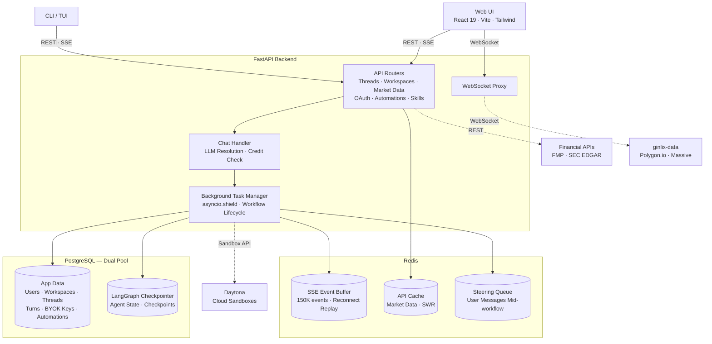
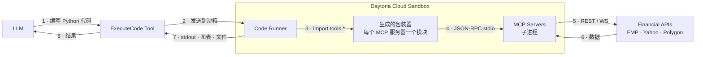
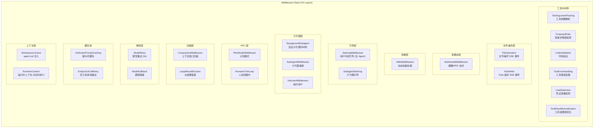
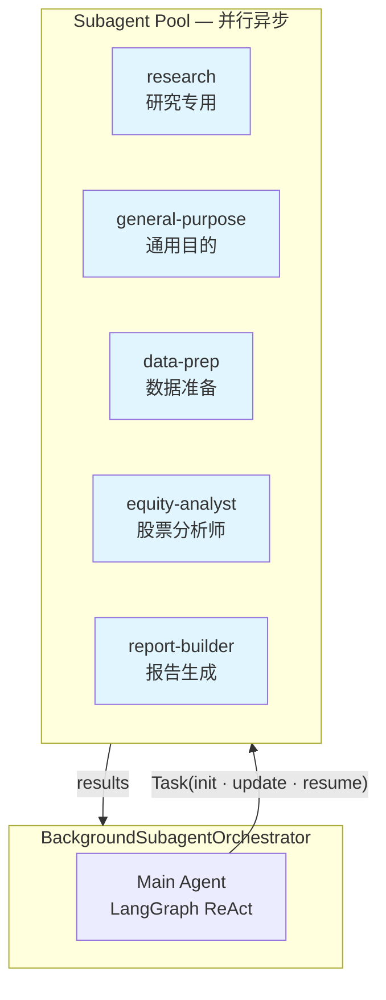
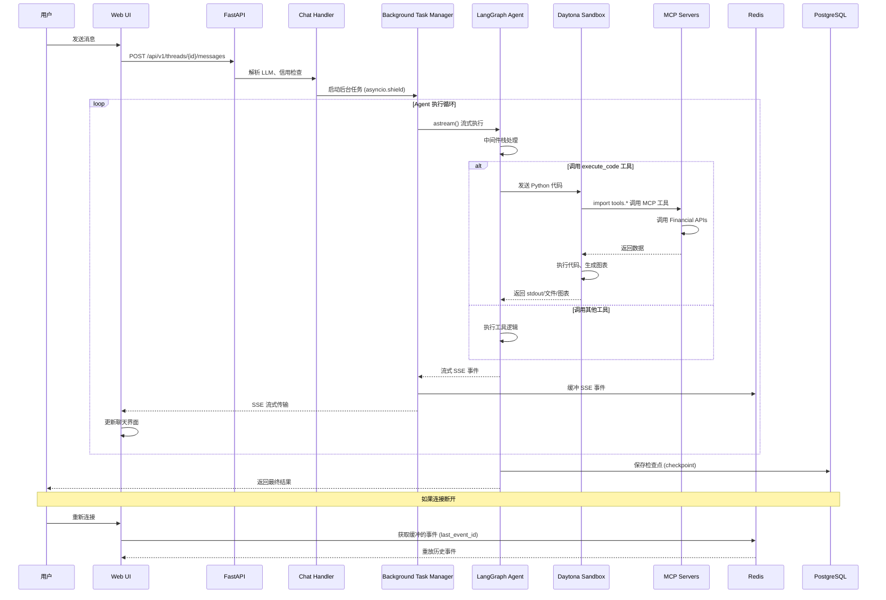
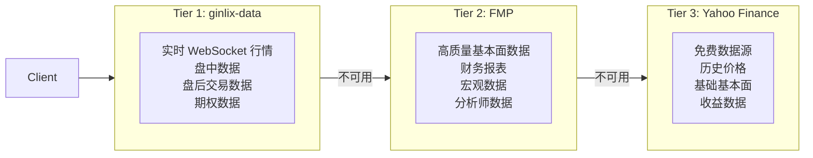
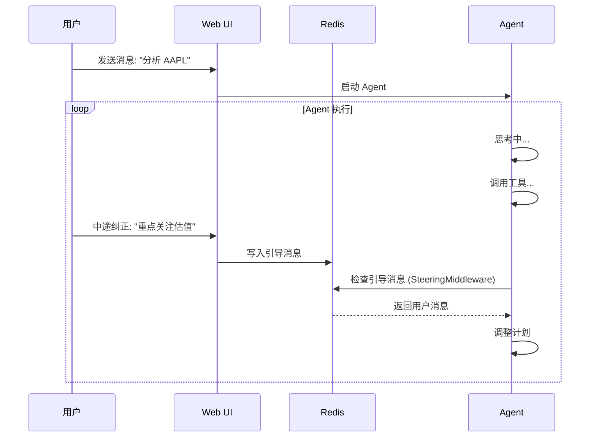
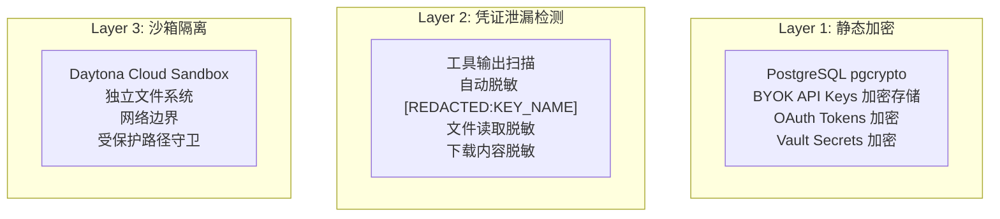
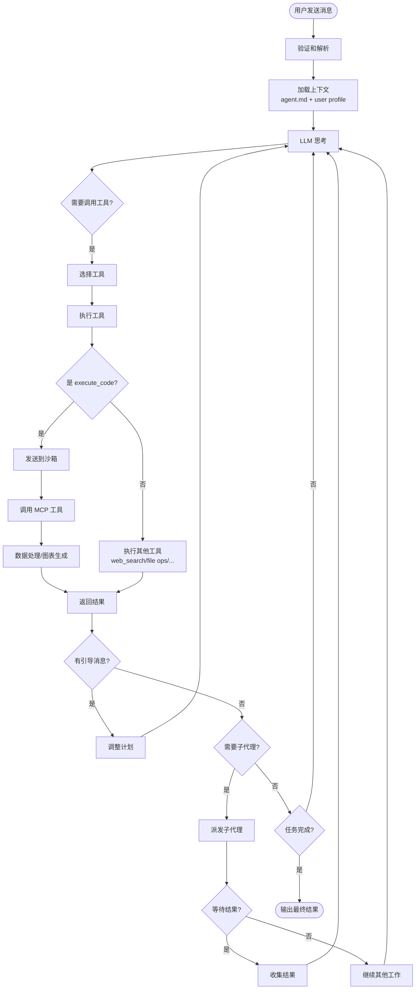
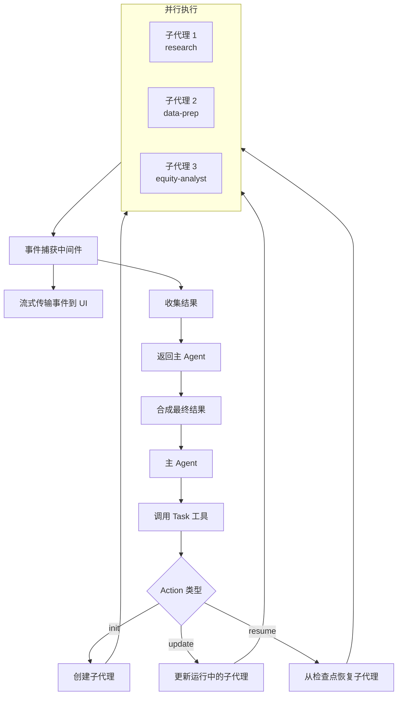

# LangAlpha 代码逻辑与技术方案分析

> **项目地址**: https://github.com/ginlix-ai/LangAlpha
> **项目简介**: 一个基于 LangGraph 的金融研究 AI Agent 系统，采用 PTC (Programmatic Tool Calling) 模式
> **分析日期**: 2026-04-21

---

## 一、项目概述

LangAlpha 是一个"vibe investing agent harness"，旨在帮助解释金融市场并支持投资决策。与传统的单次问答式 AI 金融工具不同，LangAlpha 采用贝叶斯式的迭代研究方法，支持跨会话的知识积累。

### 核心特性

- **PTC (Programmatic Tool Calling)**: Agent 编写并执行 Python 代码来处理金融数据
- **持久化工作空间**: 每个工作空间映射到独立的沙箱环境
- **Agent Swarm**: 支持并行异步子代理执行
- **多渠道集成**: 支持 Web UI、Slack、Discord、Feishu 等
- **金融数据生态**: 多层数据提供商体系（ginlix-data → FMP → Yahoo Finance）

---

## 二、系统架构

### 2.1 技术栈

| 层级 | 技术选型 |
|------|----------|
| **后端框架** | FastAPI + LangChain/LangGraph |
| **前端框架** | React 19 + Vite 7 + TypeScript + Tailwind CSS |
| **数据库** | PostgreSQL (双连接池: 应用数据 + LangGraph 检查点) |
| **缓存/消息** | Redis (SSE 事件缓冲 + 数据缓存 + 用户引导队列) |
| **沙箱执行** | Daytona Cloud Sandbox (或 Docker 本地沙箱) |
| **ORM** | 原始 SQL (psycopg3) + Alembic 迁移 |
| **LLM 支持** | Gemini, OpenAI, Anthropic, DeepSeek, Qwen, Kimi 等 |

### 2.2 系统架构图



---

## 三、Agent 核心架构

### 3.1 Agent 创建流程

Agent 通过 `PTCAgent.create_agent()` 方法创建，核心步骤：

1. **初始化后端**: 创建 `SandboxBackend` 统一处理工具、中间件和技能发现的沙箱 I/O
2. **创建工具集**: 
   - `execute_code`: PTC 核心工具，在沙箱中执行 Python 代码
   - `bash` / `bash_output`: Shell 命令执行
   - `preview_url`: 沙箱服务预览
   - `show_widget`: 内联 HTML 可视化
   - 文件系统工具: `read_file`, `write_file`, `edit_file`, `glob`, `grep`
   - 金融工具: SEC 文件、股票价格、公司概览、期权链等
   - Web 工具: `web_search`, `web_fetch`
3. **构建中间件栈**: 24 层中间件按序组合
4. **创建子代理**: 从注册表加载启用的子代理
5. **编译 Agent**: 使用 LangChain 的 `create_agent()` 创建 ReAct Agent
6. **包装 Orchestrator**: 用 `BackgroundSubagentOrchestrator` 包装以支持后台执行

### 3.2 代码位置

```
src/ptc_agent/agent/
├── agent.py              # PTCAgent 主类
├── graph.py              # LangGraph 图构建工厂
├── backends/            # 沙箱后端实现
├── flash/               # Flash 模式 Agent (轻量级)
├── middleware/          # 24 层中间件实现
│   ├── background_subagent/  # 子代理编排
│   ├── tool/            # 工具中间件
│   ├── file_operations/ # 文件操作 SSE 事件
│   ├── compaction/      # 上下文压缩
│   ├── skills/          # 技能加载
│   └── ...
├── prompts/             # Jinja2 提示词模板
├── subagents/           # 子代理定义和编译
│   ├── builtins.py      # 内置子代理
│   ├── compiler.py      # 子代理编译器
│   └── registry.py     # 子代理注册表
└── tools/               # Agent 工具实现
```

---

## 四、PTC (Programmatic Tool Calling) 模式

### 4.1 核心思想

传统 AI Agent 通过 JSON tool calls 直接调用工具，将原始数据塞入 LLM 上下文窗口。PTC 模式颠覆这一流程：

**LLM → 编写 Python 代码 → 在沙箱中执行 → 返回最终结果**

这样做的好处：
- 减少 token 浪费（只返回最终结果，不返回原始数据）
- 支持复杂多步分析（数据处理、图表生成、建模）
- 突破上下文限制（在沙箱中处理大规模数据）

### 4.2 PTC 执行流程



### 4.3 代码示例

Agent 生成的 Python 代码可能如下：

```python
# Agent 生成的代码示例
import tools.price_data as price_data
import tools.fundamentals as fundamentals
import pandas as pd
import matplotlib.pyplot as plt

# 获取股票价格数据
prices = price_data.get_stock_data(
    symbol="AAPL",
    start_date="2024-01-01",
    end_date="2024-12-31",
    interval="1day"
)

# 获取基本面数据
financials = fundamentals.get_financial_statements(
    symbol="AAPL",
    statement_type="income",
    period="annual"
)

# 数据处理和分析
df = pd.DataFrame(prices)
# ... 复杂计算 ...

# 生成图表
plt.figure(figsize=(12, 6))
plt.plot(df['date'], df['close'])
plt.savefig('/home/workspace/results/aapl_price_chart.png')

print("Analysis complete. Chart saved to results/aapl_price_chart.png")
```

---

## 五、中间件栈详解

LangAlpha 的 Agent 行为通过 **24 层中间件**组合而成，而非手写的状态图。这种设计使得 Agent 行为高度可定制。

### 5.1 中间件分层



### 5.2 关键中间件说明

| 中间件 | 功能 | 位置 |
|--------|------|------|
| **ToolArgumentParsing** | 解析工具调用的参数，支持 JSON 和自然语言 | 最外层 |
| **ProtectedPath** | 防止 Agent 访问受保护路径（如 `/etc`, `/home/workspace/_internal`） | 工具执行前 |
| **LeakDetection** | 扫描工具输出中的凭证（API Key、OAuth Token），自动脱敏 | 工具执行后 |
| **Steering** | 检查 Redis 中的用户引导消息，允许中途纠正 Agent 行为 | 每次 LLM 调用前 |
| **Compaction** | 当上下文接近 token 限制时，自动压缩对话历史 | 动态触发 |
| **SubAgentMiddleware** | 管理子代理的创建、执行和结果收集 | 主 Agent 专用 |
| **SkillsMiddleware** | 动态发现和加载技能包（SKILL.md） | 按需加载 |
| **WorkspaceContext** | 将 `agent.md` 注入系统提示词，实现跨会话记忆 | 每次模型调用 |

---

## 六、Agent Swarm (子代理系统)

### 6.1 架构设计

LangAlpha 支持 **并行异步子代理**，每个子代理拥有独立的上下文窗口和工具集。



### 6.2 内置子代理

| 子代理名称 | 模式 | 工具集 | 最大迭代 | 状态化 | 用途 |
|-----------|------|---------|---------|--------|------|
| **research** | PTC | web_search, filesystem | 5 | ❌ | 专项研究任务 |
| **general-purpose** | PTC | execute_code, filesystem, bash, finance, web_search | 10 | ✅ | 复杂多步操作 |
| **data-prep** | PTC | execute_code, filesystem, bash, finance | 10 | ✅ | 数据获取和预处理 |
| **equity-analyst** | PTC | execute_code, filesystem, bash, finance, web_search | 15 | ✅ | 公司分析、估值 |
| **report-builder** | PTC | execute_code, filesystem, bash | 20 | ✅ | 生成 DOCX/XLSX/PPTX/PDF |

### 6.3 子代理通信机制

1. **主 Agent → 子代理**: 通过 `Task()` 工具派发任务
2. **子代理 → 主 Agent**: 返回合成结果
3. **中途更新**: 主 Agent 可以通过 `Task(action="update")` 向运行中的子代理发送后续指令
4. **断点恢复**: 通过 `Task(action="resume")` 从检查点恢复已完成的子代理
5. **实时监视**: UI 中可实时查看子代理的流式输出和工具调用

---

## 七、数据流详解

### 7.1 完整请求流程



### 7.2 SSE 事件类型

| 事件类型 | 说明 |
|---------|------|
| `message_chunk` | LLM 生成的文本片段 |
| `tool_calls` | 工具调用请求（含参数） |
| `tool_call_result` | 工具调用结果 |
| `artifact` | 生成的文件（图表、报告等） |
| `human_interrupt` | 人在回路中中断 |
| `subagent_status` | 子代理状态更新 |
| `context_window` | 上下文窗口压缩通知 |

---

## 八、金融数据生态

### 8.1 三层数据提供商体系

LangAlpha 实现了 **三层数据提供商降级链**，确保数据可用性：



### 8.2 MCP 服务器

LangAlpha 通过 **MCP (Model Context Protocol)** 服务器提供金融数据工具：

| MCP 服务器 | 功能 | 工具暴露模式 |
|-----------|------|-------------|
| **price_data** | OHLCV 时间序列（股票、商品、加密货币、外汇） | detailed |
| **fundamentals** | 财务报表、比率、增长率、估值 | summary |
| **macro** | GDP、CPI、失业率、国债收益率曲线、经济日历 | summary |
| **options** | 期权链、历史 OHLCV、实时买卖盘 | detailed |
| **yf_price** | Yahoo Finance 价格历史、分红、拆分 | summary |
| **yf_fundamentals** | Yahoo Finance 财务报表、收益、估值 | summary |
| **scrapling** | Web 爬虫（支持 Cloudflare 绕过） | summary |

### 8.3 工具发现机制

- **Tool Discovery**: 默认启用，MCP 工具以摘要形式加载到上下文
- **Lazy Load**: 延迟加载，按需获取完整文档
- **Skill Binding**: 可以将 JSON 工具与技能绑定，仅在技能激活时暴露给 Agent

---

## 九、工作空间与持久化

### 9.1 工作空间架构

每个工作空间映射到 **一个独立的 Daytona 沙箱**，具有结构化目录布局：

```
/home/workspace/
├── agent.md              # 持久化记忆文件（跨会话）
├── work/                 # 每任务工作区
│   ├── task_1/
│   │   ├── data/        # 数据文件
│   │   ├── charts/      # 图表输出
│   │   └── code/        # 生成的代码
│   └── task_2/
├── results/              # 最终报告
├── data/                 # 共享数据集
├── tools/               # MCP 包装器
└── .agents/
    └── threads/
        └── {thread_id}/
            └── large_tool_results/  # 大结果驱逐目录
```

### 9.2 agent.md 持久化记忆

`agent.md` 是工作空间的核心记忆文件，包含：

1. **工作空间目标**: 研究主题、投资逻辑
2. **关键发现**: 重要结论、数据洞察
3. **线程索引**: 所有对话线程的摘要
4. **文件索引**: 重要 artifacts 的索引

**注入机制**: `WorkspaceContextMiddleware` 在每次模型调用前将 `agent.md` 注入系统提示词。

### 9.3 数据库架构

```
User → Workspace (1:1 Daytona sandbox) → Thread → Turns (query + response + usage)
```

**双连接池设计**:
- **应用数据池**: Users, Workspaces, Threads, Turns, BYOK Keys, Automations
- **LangGraph 检查点池**: Agent State, Checkpoints

---

## 十、前端架构

### 10.1 技术栈

- **框架**: React 19 + Vite 7
- **语言**: TypeScript
- **样式**: Tailwind CSS 3 + shadcn/ui
- **状态管理**: React Query (@tanstack/react-query)
- **认证**: Supabase (可选，本地开发时禁用)

### 10.2 核心页面

| 页面 | 功能 |
|------|------|
| **ChatAgent** | 主 AI 聊天界面，SSE 流式传输 |
| **Dashboard** | 市场概览、关注列表、投资组合、新闻 |
| **MarketView** | 实时市场图表（TradingView 集成） |
| **Automations** | 定时自动化 CRUD（cron 构建器） |
| **Subagents** | 实时监视子代理进度 |

### 10.3 SSE 流式传输

前端通过原生 `fetch()` + `ReadableStream` 实现 SSE 流式传输：

```typescript
// 伪代码
const response = await fetch('/api/v1/threads/{id}/messages', {
  method: 'POST',
  body: JSON.stringify({ message })
});

const reader = response.body.getReader();
const decoder = new TextDecoder();

while (true) {
  const { done, value } = await reader.read();
  if (done) break;
  
  const chunk = decoder.decode(value);
  // 解析 SSE 事件并更新 UI
  handleSSEEvent(chunk);
}
```

---

## 十一、创新特性

### 11.1 实时引导 (Live Steering)

允许用户在 Agent 执行过程中发送后续消息进行纠正：



### 11.2 计划模式 (Plan Mode)

支持 **人在回路中 (HITL)** 的工作流：

1. Agent 生成执行计划
2. 通过 `submit_plan` 工具提交计划
3. 系统中断执行，等待用户审批
4. 用户批准/拒绝/修改计划
5. Agent 按批准的计划执行

### 11.3 自动化系统

支持三种自动化类型：

| 类型 | 触发条件 | 示例 |
|------|---------|------|
| **时间触发** | Cron 表达式 | "每周一 9 AM 运行分析" |
| **一次性** | 指定日期时间 | "2026-05-01 10:00 运行" |
| **价格触发** | 股票价格条件 | "当 AAPL 突破 $200 时分析" |

**价格触发实现**:
- `PriceMonitorService` 订阅共享的 WebSocket 连接
- 从 ginlix-data 获取实时 tick 数据
- Redis 去重防止跨服务器实例重复触发

---

## 十二、安全模型

### 12.1 三层安全架构



### 12.2 Workspace Vault

每个工作空间内置 **秘密保管库**，可在代码执行期间使用：

```python
from vault import get, list_names, load_env

api_key = get("MY_API_KEY")       # 获取单个秘密
names = list_names()                # 列出所有秘密名称
load_env()                          # 批量加载所有秘密为环境变量
```

**安全特性**:
- 静态加密（pgcrypto）
- 自动脱敏（所有输出）
- 禁止直接文件访问
- 仅工作空间所有者可管理

---

## 十三、部署与运行

### 13.1 Docker 部署（推荐）

```bash
# 克隆仓库
git clone https://github.com/ginlix-ai/LangAlpha.git
cd LangAlpha

# 交互式配置向导
make config

# 启动所有服务（PostgreSQL + Redis + Backend + Frontend）
make up
```

访问:
- **前端**: http://localhost:5173
- **后端 API**: http://localhost:8000
- **API 文档**: http://localhost:8000/docs

### 13.2 配置层次

| 文件 | 用途 |
|------|------|
| `.env` | 凭证和 URL（gitignore） |
| `agent_config.yaml` | Agent 能力（LLM、MCP、子代理、工具） |
| `config.yaml` | 基础设施（CORS、Redis TTL、超时） |

### 13.3 可选依赖

| 环境变量 | 功能 |
|---------|------|
| `DAYTONA_API_KEY` | 持久化云沙箱 |
| `FMP_API_KEY` | 高质量基本面数据 |
| `SERPER_API_KEY` / `TAVILY_API_KEY` | Web 搜索 |
| `LANGSMITH_API_KEY` | 追踪和可观测性 |

---

## 十四、代码质量与测试

### 14.1 代码规范

- **Python**: Ruff linting (仅忽略 E741)，Python 3.12+
- **前端**: ESLint 9 flat config
- **测试**: 后端 pytest，前端 Vitest + Testing Library
- **包管理器**: `uv` (Python), `pnpm` (前端)

### 14.2 测试策略

```bash
# 后端测试
uv run pytest tests/unit/ -v                     # 单元测试
uv run pytest tests/integration/ -v -m integration  # 集成测试

# 前端测试
cd web && pnpm vitest run                       # 所有测试
cd web && pnpm vitest                           # watch 模式
```

---

## 十五、总结与启示

### 15.1 核心技术亮点

1. **PTC 模式创新**: 通过代码执行而非直接工具调用，突破上下文限制
2. **中间件架构**: 24 层中间件实现高度模块化和可定制
3. **Agent Swarm**: 并行子代理提升复杂任务处理效率
4. **持久化工作空间**: `agent.md` 实现跨会话记忆积累
5. **三层数据体系**: 优雅降级确保数据可用性
6. **实时引导**: 用户在 Agent 执行过程中可中途纠正

### 15.2 适用场景

- ✅ **深度金融研究**: 公司分析、估值建模、行业研究
- ✅ **投资决策支持**:  Morning Note、催化剂日历、理念追踪
- ✅ **自动化工作流**: 定时报告、价格触发提醒
- ✅ **教育和学习**: 理解 AI Agent 系统架构的最佳实践

### 15.3 架构启示

1. **中间件优于状态图**: LangAlpha 不用手写 StateGraph，而是用中间件栈组合 Agent 行为，更灵活
2. **代码执行优于 JSON 工具调用**: PTC 模式适合数据密集型任务
3. **持久化优于无状态**: 工作空间 + agent.md 实现研究积累
4. **并行优于串行**: Agent Swarm 提升复杂任务效率
5. **安全分层**: 加密 + 泄漏检测 + 沙箱隔离三重保护

---

## 十六、附录：关键文件索引

| 文件路径 | 说明 |
|---------|------|
| `src/ptc_agent/agent/agent.py` | PTCAgent 主类，创建 Agent 和中间件栈 |
| `src/ptc_agent/agent/graph.py` | LangGraph 图构建工厂 |
| `src/ptc_agent/agent/middleware/__init__.py` | 所有中间件的导出 |
| `src/ptc_agent/agent/subagents/builtins.py` | 内置子代理定义 |
| `src/ptc_agent/agent/subagents/compiler.py` | 子代理编译器 |
| `src/ptc_agent/core/sandbox.py` | 沙箱管理 |
| `src/ptc_agent/core/mcp_registry.py` | MCP 注册表 |
| `src/server/` | FastAPI 后端服务 |
| `src/tools/` | LangChain 工具（Web 搜索、市场数据、SEC） |
| `src/llms/` | LLM 封装、token 计数、定价 |
| `web/src/pages/ChatAgent/` | 前端主聊天界面 |
| `agent_config.yaml` | Agent 配置文件 |
| `config.yaml` | 基础设施配置文件 |

---

## 十七、工作流程图汇总

### 17.1 主 Agent 工作流程



### 17.2 子代理编排流程



---

**文档版本**: v1.0
**生成工具**: AI 代码分析
**最后更新**: 2026-04-21
